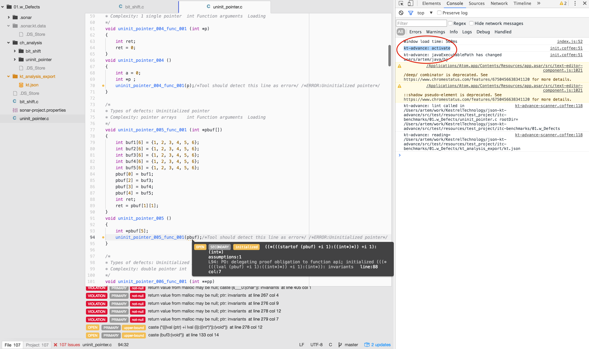
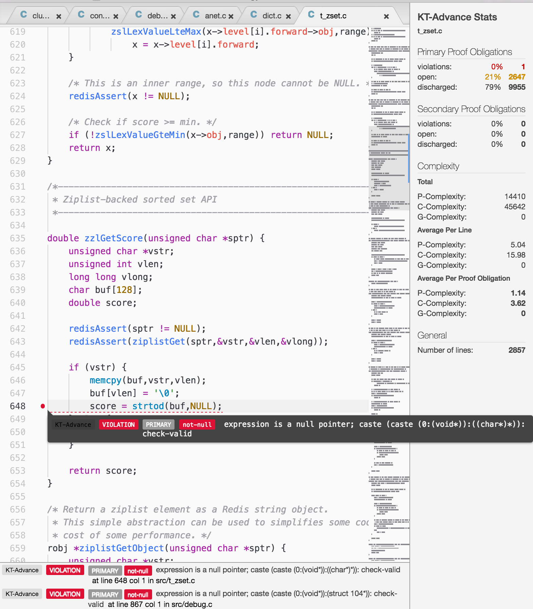

# KT-Advance C Analyzer Atom Package for Linter

## Installation and First Run

1. Make sure Java 8 is installed on your computer and is available on $PATH. In Terminal, type `java -version`, if it says `command not found`, stop reading this doc.  Java 8 installation kits can be found at [Oracle](http://www.oracle.com/technetwork/java/javase/downloads/jdk8-downloads-2133151.html).   
1. Make sure `atom` and its package manager `apm` are installed.  Running `apm -v` should list its version number and some others.
1. The `atom-kt-advance` package is based on the `linter` package. So, install it from https://atom.io/packages/linter
1. Download and configure the plugin code.
Download the `atom-kt-advance` project code from [https://github.com/compartia/atom-kt-advance](https://github.com/compartia/atom-kt-advance).  Change into the project directory `cd atom-kt-advance`. Run the Atom package manager's linker to create a symbolic link between the Atom packages and this project `apm link`.  (Use `apm unlink` to remove the symbolic link.)
1. Remove any existing `kt_analysis_export` directories from the C project to be analyzed.  These may contain plugin output so updated plugin software may be incompatible with older files.
1. Relaunch Atom.
1. Raise Atom's Command Palette (e.g. &#8679;+&#8984;+<kbd>P</kbd> on a Mac). Run the command "Update Package Dependencies: Update".
1. In Atom, open a sample KT-Advance-analyzed C project (for example, this one: [https://github.com/mrbkt/kestreltech/tree/master/src/test/resources/test_project/itc-benchmarks/01.w_Defects](https://github.com/mrbkt/kestreltech/tree/master/src/test/resources/test_project/itc-benchmarks/01.w_Defects)).  
1. Raise Atom's Developer's Tools Console (e.g. &#8984;+
&#8997;+<kbd>i</kbd> on a Mac) and confirm the line logged `kt-advance: activate`.  This indicates a successful launch.  Upon activation the plugin spawns a Java process to scan the C project for the `ch_analysis` directory.  When the plugin's scanner has completed you should see new or updated files in the `kt_analysis_export` directory.
  

  
1. Open a C file and save it (e.g. &#8984;+<kbd>S</kbd> on a Mac) in order to initiate a rescan (`linter` is triggered every time a C file is saved).
  

## Dependencies
1.  This package depends on [https://github.com/compartia/kt-advance-to-json](https://github.com/compartia/kt-advance-to-json) which in turn depends on [https://github.com/mrbkt/kestreltech/tree/atom-tools](https://github.com/mrbkt/kestreltech/tree/atom-tools).
2. Linter package: [https://atom.io/packages/linter](https://atom.io/packages/linter).
